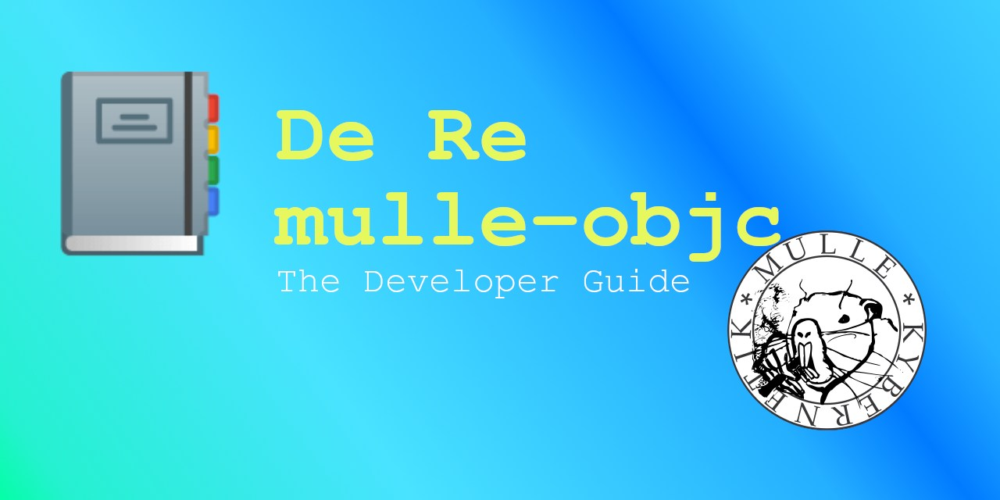



Welcome to the developer guide for [mulle-objc](//mulle-objc.github.io). This
guide will enable you to get up and running quickly with Objective-C on the
platform of your choice.

## System Requirements

mulle-objc is C, so anywhere C runs Objective-C should run too. But that's
not entirely true. mulle-objc is not suitable for tiny CPUs. When you
build the Foundation library as a shared library you end up with 2.5MB
(mulle-objc 0.5MB). So any system with less than 4MB RAM, will likely not
cut it. The CPU needs to be at least 32 bit wide to be able to
use mulle-objc selectors efficiently.

You can expect the MulleObjC library to work on any suitable ARM or X86_64 or I686 system. The Foundation support outside of Linux, FreeBSD and macOS is still somewhat iffy.

## License

mulle-objc is permissively - BSD3 - licensed and free of cost, meaning
you can use it anywhere you like and wish.

## Objective-C Tutorials

A complete Objective-C tutorial is outside the scope of this manual, but
there some useful ones online, in case you are not familiar with the
language. Most of these cover Objective-C in its 2.0 (Apple) incarnation. Consult [Differences to Objective-C 2.0](differences.html) if you are in doubt about the applicability of what's written to mulle-objc.

In general ignore parts about "gcc", "Xcode", "MacOSX", "GNUStep". Ignore parts about "Dot Syntax" as well as "Blocks" and anything mentioning "ARC".

|  Resource   | Publisher | Description
|---------|-----------|-----------------
| [Ry’s Objective-C Tutorial](https://fullonrager.github.io/rys-objective-c-tutorial-archive/introduction.html) | RyPress | Very easy to read. Just keep in mind, that mulle-objc prefers `+object` over `+alloc`/`-init` and prefers `mulle_printf` over `NSLog`
| [Learn Objective-C Quick Guide](https://www.tutorialspoint.com/objective_c/objective_c_quick_guide.htm) | Tutorialspoint | Looks like a good tutorial.
| [Objective-C Tutorial](https://codescracker.com/objective-c/index.htm)  |  Codecrackers | This is basically the same as whats offered at Tutorialspoint, but there are differences. Someone plagiarized but I can't tell who did it. The codecrackers page looks a bit nicer
| [Objective-C Tutorial](https://etutorials.org/Programming/Cocoa/Part+I+Introducing+Cocoa/Chapter+1.+Objective-C/) tutorial | Etutorials | ???
| [Learn Objective-C](https://www.cocoadevcentral.com/d/learn_objectivec) |  CocoaDev | Gives a quick overview of concepts.
| [Programming With Objective C](https://developer.apple.com/library/archive/documentation/Cocoa/Conceptual/ProgrammingWithObjectiveC/Introduction/Introduction.html) | Apple | This covers all the basics.

## mulle-objc Reads

Once you got the hang on Objective-C, the following list of mulle-objc
pamphlets will surely be of interest:

| Title | Description |
|-------|-------------|
| [De Re NSObject](https://www.mulle-kybernetik.com/de-re-nsobject) | All about NSObject, object management, @autoreleasepool and coding conventions. A must read. |
| [De Re @property](https://www.mulle-kybernetik.com/de-re-property/) | All about @property and its attributes. Required reading for all mulle-objc developers. |
| [Objective-C Runtime in Pictures](https://www.mulle-kybernetik.com/objc-runtime-in-pictures/) | The bits and bytes perspective on the mulle-objc runtime |
| [mulle-objc Development with IDEs](https://www.mulle-kybernetik.com/mulle-objc-ide/) | How to setup several popular IDEs for mulle-objc development |
| [De Re mulle-sde](https://www.mulle-kybernetik.com/de-re-mulle-sde/) | Developer guide for mulle-sde, should cover most workflow topics |
| [mulle-objc CheatSheet](https://github.com/mulle-objc/Objective-C-CheatSheet) | The is a good way to get a quick overview of what the Mulle Objective-C dialect has to offer. It is tailored to mulle-objc specifically, but it is no tutorial.
| [Mulle-sde WiKi](https://github.com/mulle-sde/mulle-sde/wiki) | Mulle-sde WIKI more indepth information about the tooling |
| [mulle-objc community membership](https://github.com/mulle-objc/mulle-objc.github.io/issues/1) | It's free!

## Other Objective-C Reads

Most of these books cover Objective-C in its 2.0 incarnation. Consult
[Differences to Objective-C 2.0](differences.html),
if you are in doubt about the applicability of what's written:

|  Resource   | Publisher | Description
|-------------|-----------|-----------------
| [Concepts in Objective-C Programming](https://developer.apple.com/library/archive/documentation/General/Conceptual/CocoaEncyclopedia/Introduction/Introduction.html) | Apple | This is a more in-depth read to understand some terminology used by fellow Objective-C coders. Ignore the chapters "Delegates and Data Sources", "Model View Controller", "Object Modeling", "Outlets", "Receptionist Pattern", "Target-Action", "Toll-Free Bridging"
| [NSHipster](https://nshipster.com/) | Mattt | Some articles cover Objective-C and the Foundation
| &nbsp; | [onlineprogrammingbooks](https://www.onlineprogrammingbooks.com/objective-c/) | A list of downloadable book PDFs.
| [Zen and the Art of the Objective-C Craftsmanship](https://github.com/objc-zen/objc-zen-book)](https://github.com/objc-zen/objc-zen-book) | Bernardi - De Bortoli | A more advanced read. On a cursory examination, there is a lot there, that's not applicable to mulle-objc or that goes against the mulle-objc style.

## mulle-objc Portal

Periodically check out [mulle-objc](https://mulle-objc.github.io) which is the portal
for all things mulle-objc.

## Next

Now its tile fo create your first [project](mydoc_modern.html).
